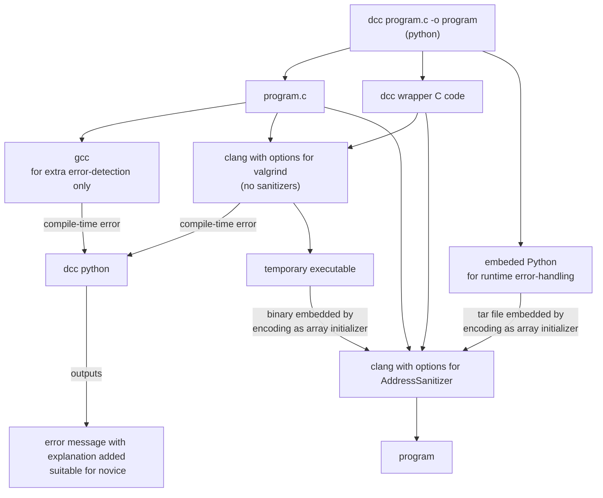
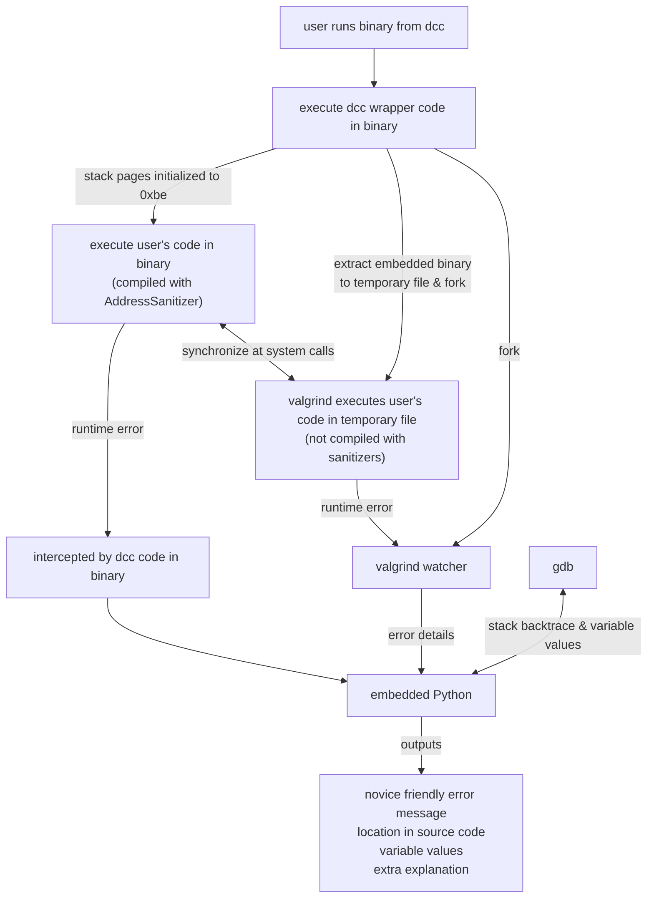

# Introduction

dcc helps novice C programmers by catching common errors and providing easy-to-understand explnations.

For example:

dcc add extra runtime checking for errors and prints information
likely to be helpful to novice programmers, including
printing values of variables and expressions.
Run-time checking includes array indices, for example:

```
$ gcc count_zero.c
$ ./a.out
9
$ dcc count_zero.c
$ ./a.out
count_zero.c.c:7:7: runtime error - index 10 out of bounds for type 'int [10]'
dcc explanation: You are using an illegal array index: 10
  Valid indices for an array of size 10 are 0..9
  Make sure the size of your array is correct.
  Make sure your array indices are correct.
Execution stopped in main() in count_zero.c at line 7:

int main(void) {
	int numbers[10] = {0};
	int count = 0;
	for (int i = 1; i <= 10; i++) {
-->		if (numbers[i] > 0) {
			count++;
		}
	}

Values when execution stopped:
count = 0
i = 10
numbers = {0, 0, 0, 0, 0, 0, 0, 0, 0, 0}
numbers[i] = <uninitialized value>
```

Run-time checking also includes pointer dereferences, for example:

```
$ gcc linked_list.c
$ a.out
Segmentation fault (core dumped)
$ dcc linked_list.c
$ a.out
linked_list.c:12:15: runtime error - accessing a field via a NULL pointer
dcc explanation: You are using a pointer which is NULL
  A common error is  using p->field when p == NULL.
Execution stopped in main() in linked_list.c at line 12:

int main(void) {
    struct list_node s = {0};
    struct list_node *a = &s;
    while (a != NULL) {
-->     a->next->data = 42;
        a = a->next;
    }
}

Values when execution stopped:
s = {next = NULL, data = 0}
a->next = NULL
```

dcc also embeds code to detect use of uninitialized variables, for example:

```
$ gcc uninitialised_variable.c
$ a.out
0
$ dcc uninitialised_variable.c
$ a.out
Runtime error: uninitialized variable accessed.
Execution stopped in main() in uninitialised_variable.c at required:

int main(void) {
    int numbers[10];
    for (int i = 1; i < 10; i++) {
        numbers[i] = i;
    }
--> printf("%d\n", numbers[0]);
}

Values when execution stopped:
numbers = {<uninitialized value>,1,2,3,4,5,6,7,8,9}
numbers[0] = <uninitialized value>
```

dcc compiles C programs using clang and adds explanations suitable for novice programmers
to compiler messages novice programmers are likely to encounter and not understand.
For example:

```
$ dcc a.c
a.c:3:15: warning: address of stack memory associated with local variable 'counter' returned [-Wreturn-stack-address]
        return &counter;

dcc explanation: you are trying to return a pointer to the local variable 'counter'.
  You can not do this because counter will not exist after the function returns.
  See more information here: https://comp1511unsw.github.io/dcc/stack_use_after_return.html
```

Uninitialized variables are detected by running valgrind simultaneously as a separate process.

The synchronisation of the 2 processes is only effective for the standard C library (signal.h and threads.h excepted).
which should include almost all typical programs written by novice programmers.
If synchronisation is lost the 2nd process should terminate silently.

If libraries other the standard C library are used, uninitialized variables does not occur.
 
# Leak checking

dcc can also embed code to check for memory leaks:

```
$ dcc  --leak-check leak.c
$ ./a.out
Error: free not called for memory allocated with malloc in function main in leak.c at line 3.
```

# Runtime Helper Script

After reporting a runtime error an executable produced by `dcc`  can optionally run an external program.

After reporting a runtime error a `dcc` executable checks if an executable
named **dcc-runtime-helper** exists in `$PATH` and if so runs it.

An alternate name for the executable file can be supplied in the environment variable `DCC_RUNTIME_HELPER`

The helper executable is run with a different working directory to the orignal executable.
It is run in a temporary directory created by the dcc executable which contains the source
to the original executable and dcc infrastructure files.

These environment variable are supplied to the helper script. They may be empty.

- `DCC_PWD` - the original directory where the executable was run
- `HELPER_FILENAME` - source filename where error occurred
- `HELPER_LINE_NUMBER` - source line number where error occurred
- `HELPER_COLUMN`  - source column where error occurred
- `HELPER_SOURCE` - source lines surrounding error
- `HELPER_CALL_STACK` - function call stack 
- `HELPER_VARIABLES` - current values of variables near the error location
- `HELPER_JSON` - above variables encoded as JSON

# Compile Helper Script

After reporting a compiler message `dcc`  can optionally run an external program.

After reporting a compiler message `dcc`  checks if an executable
named **dcc-compile-helper** exists in `$PATH` and if so runs it.

An alternate name for the executable file can be supplied in the environment variable `DCC_COMPILE_HELPER`

These environment variable are supplied to the helper script. They may be empty.

- `LOGGER_ARGV` - compiler command-line arguments
- `LOGGER_RETURNCODE` - compiler exit status
- `LOGGER_JSON` - above variables encoded as JSON

# Compile Logger Script

After completing a compilation message `dcc`  can optionally log the details.

After reporting a compiler message `dcc`  checks if an executable
named **dcc-compile-logger** exists in `$PATH` and if so runs it.

An alternate name for the executable file can be supplied in the environment variable `DCC_COMPILE_LOGGER`

These environment variable are supplied to the helper script. They may be empty.

- `HELPER_COMPILER_MESSAGE` - compiler message
- `HELPER_MESSAGE_TYPE` - message type (e.g warning)
- `HELPER_FILENAME` - source filename where error occurred
- `HELPER_LINE_NUMBER` - source line number where error occurred
- `HELPER_COLUMN`  - source column where error occurred
- `HELPER_EXPLANATION` - dcc text explaining error
- `HELPER_JSON` - above variables encoded as JSON

# Output checking

dcc can check a program's output is correct.  If a program outputs an incorrect line, the program is stopped.  A description of why the output is incorrect is printed.  The current execution location is shown with the current values of variables & expressions.

The environment variable DCC_EXPECTED_STDOUT should be set to the expected output.

If `DCC_IGNORE_CASE` is true, case is ignored when checking expected output.  Default false.

`DCC_IGNORE_WHITE_SPACE` is true, white space is ignored when checking expected output.  Default false.

`DCC_IGNORE_TRAILING_WHITE_SPACE` is true, trailing white space is ignored when checking expected output.   Default true.

`DCC_IGNORE_EMPTY_LINES` is true, empty lines are ignored when checking expected output.  Default false.

`DCC_COMPARE_ONLY_CHARACTERS` is set to a non-empty string, the characters not in the string are ignored when checking expected output. New-lines can not be ignored.

`DCC_IGNORE_CHARACTERS` is set to a non-empty string, the characters in the string are ignored when checking expected output. New-lines can not be ignored.

`DCC_IGNORE_CHARACTERS` and `DCC_IGNORE_WHITE_SPACE`  take precedence over `DCC_COMPARE_ONLY_CHARACTERS`

Environment variables are considered true if their value is a non-empty string starting with a character other than '0', 'f' or 'F'.  They are considered false otherwise.

# Local Variable Use After Function Return Detection

```
$ dcc --use-after-return bad_function.c
$ ./a.out
bad_function.c:22 runtime error - stack use after return

dcc explanation: You have used a pointer to a local variable that no longer exists.
  When a function returns its local variables are destroyed.

For more information see: https://comp1511unsw.github.io/dcc//stack_use_after_return.html
Execution stopped here in main() in bad_function at line 22:


	int *a = f(42);
-->	printf("%d\n", a[0]);
}
```

valgrind also usually detect this type of error, e.g.:

```
$ dcc --use_after_return bad_function.c
$ ./a.out
Runtime error: access to function variables after function has returned
You have used a pointer to a local variable that no longer exists.
When a function returns its local variables are destroyed.

For more information see: https://comp1511unsw.github.io/dcc//stack_use_after_return.html'


Execution stopped here in main() in tests/run_time/bad_function.c at line 22:


int main(void) {
-->	printf("%d\n", *f(50));
}
```

# Installation

* Deb-based Systems including Debian, Ubuntu, Mint and Windows Subsystem for Linux

	```bash
	curl -L https://github.com/COMP1511UNSW/dcc/releases/download/2.25/dcc_2.25_all.deb -o /tmp/dcc_2.25_all.deb
	sudo apt install /tmp/dcc_2.25_all.deb
	```

	or

	```bash
	sudo apt install  clang gcc gdb valgrind python3 curl
	sudo curl -L https://github.com/COMP1511UNSW/dcc/releases/latest/download/dcc -o /usr/local/bin/dcc
	sudo chmod o+rx  /usr/local/bin/dcc
	```

	```bash
    # on  Windows Subsystem for Linux (only) this might be necessary to run programs
	sudo bash -c "echo 0 > /proc/sys/kernel/yama/ptrace_scope;echo 1 >/proc/sys/vm/overcommit_memory"
	```

	The Ubuntu & Mint UndefinedSanitizer builds appear not to allow `__ubsan_on_report` to be intercepted
	which degrades some error reporting

* ARCH Linux

	```bash
	sudo pacman -S clang gcc gdb valgrind python3 curl
	sudo curl -L https://github.com/COMP1511UNSW/dcc/releases/latest/download/dcc -o /usr/local/bin/dcc
	sudo chmod o+rx  /usr/local/bin/dcc
	```

* RPM-based Systems including CentOS, Fedora

	```bash
	sudo yum install clang gcc gdb valgrind python3 curl
	sudo curl -L https://github.com/COMP1511UNSW/dcc/releases/latest/download/dcc -o /usr/local/bin/dcc
	sudo chmod o+rx  /usr/local/bin/dcc
	```

	On OpenSUSE:

	```bash
	sudo zypper install clang gcc gdb valgrind python3 curl
	sudo curl -L https://github.com/COMP1511UNSW/dcc/releases/latest/download/dcc -o /usr/local/bin/dcc
	sudo chmod o+rx  /usr/local/bin/dcc
	```
	
	
* MacOS
	Install python3 - see https://docs.python-guide.org/starting/install3/osx/
	Install gdb - see https://sourceware.org/gdb/wiki/PermissionsDarwin
	In your terminal, run:
	```bash
	bash <(curl -s https://raw.githubusercontent.com/COMP1511UNSW/dcc/master/install_scripts/macos_install.sh)
	```
	Note: It is usually not a good idea to blindly run remote bash scripts in your terminal, you can inspect the file by opening the URL and reading to see what it does yourself.

    ```bash
	sudo curl -L https://github.com/COMP1511UNSW/dcc/releases/latest/download/dcc -o /usr/local/bin/dcc
	sudo chmod o+rx  /usr/local/bin/dcc
    ```
	
	valgrind and MemorySanitizer are not currently supported on macOS which prevent checking for unitialized variables


# C++ Support

There is experimental support for C++ programs if `dcc` is invoked as `d++` or `dcc++`.

Install by creating a symbolic link, e.g.:

```bash
sudo ln  -sf dcc /usr/local/bin/d++
```


# Run-time Error Handling Implementation

* dcc by default enables clang's  AddressSanitizer (`-fsanitize=address`) and UndefinedBehaviorSanitizer (`-fsanitize=undefined`) extensions.

* dcc embeds in the binary produced a xz-compressed tar file (see [compile.py]) containing the C source files for the program and some Python code which is executed if a runtime error occurs.

* Sanitizer errors are intercepted by a shim for the function `__asan_on_error` in [dcc_util.c].

* A set of signals produced by runtime errors are trapped by `_signal_handler` in [dcc_util.c].

* Both functions call `_explain_error` in [dcc_util.c] which creates a temporary directory,
extracts into it the program source and Python from the embedded tar file, and executes the Python code, which:

    * runs the Python ([start_gdb.py]) to print an error message that a novice programmer will understand, then

    * starts gdb, and uses it to print current values of variables used in source lines near where the error occurred.

#  Facilitating Clear errors from Uninitialized Variables

Linux initializes stack pages to zero.  As a consequence novice programmers  writing small programs with few function calls
are likely to find zero in uninitialized local variables.  This often results in apparently correct behaviour from a
invalid program with uninitialized local variables.

dcc embeds code in the binary which initializes the first few megabytes of the stack to 0xbe (see `clear-stack` in [dcc_util.c].

For valgrind dcc uses its malloc-fill and --free-fill options to achieve the same result see [dcc_util.c].  AddressSanitizer & MemorySanitizer use a malloc which does this by default.

When printing variable values, dcc prints ints, doubles & pointers consisting of 0xbe bytes as "<uninitialized>". 

Indirection using pointers consisting of 0xbe bytes will produced an unaligned access error from  UndefinedBehaviourSanitizer, unless the pointer is to char.  dcc intercepts these and explanations suitable for novice programmers (see  explain_ubsan_error in [drive_gdb.py])

```
$ dcc dereference_uninitialized.c
$ ./a.out
tests/run_time/dereference_uninitialized_with_arrow.c:9:14: runtime error - accessing a field via an uninitialized pointer

dcc explanation: You are using a pointer which has not been initialized
  A common error is using p->field without first assigning a value to p.

Execution stopped here in main() in dereference_uninitialized.c at line 9:

int main(void) {
    struct list_node *a = malloc(sizeof *a);
--> a->next->data = 42;
}

Values when execution stopped:

a->next = <uninitialized value>
```

# Build Instructions

```bash
git clone https://github.com/COMP1511UNSW/dcc
cd dcc
make
cp -p ./dcc /usr/local/bin/dcc
```

# Compilation Diagram



Assumes the default option of AddressSanitizer + valgrind run in parallel.

# Runtime Error Handling Diagram



Assumes the default option of AddressSanitizer + valgrind run in parallel.
   
# Dependencies

clang, python3, gdb, valgrind

# Author

Andrew Taylor (andrewt@unsw.edu.au)

Code for ANSI colors in colors.py is by Giorgos Verigakis

# License

GPLv3

